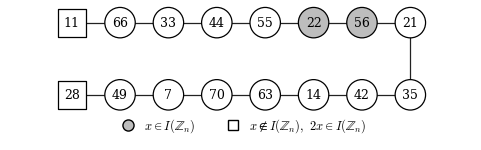
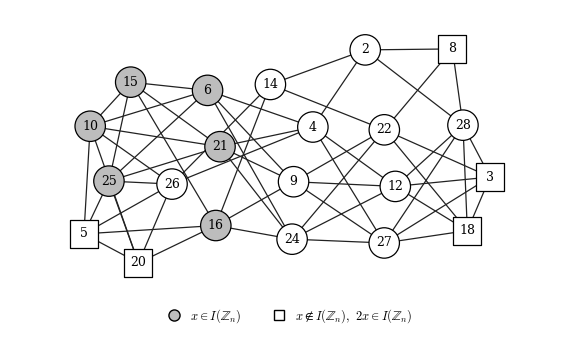

# Idempotent total graphs of the rings ℤₙ

Python code accompanying the paper

> Y. Kara, A. B. Bektaş, İ. N. Cangül,
> *Structural properties of idempotent total graphs of the rings ℤₙ* (under review).

The code is a supporting tool for the paper. It constructs and draws the graphs, and it checks the theoretical results by computer. It is not needed for any of the proofs.

## The graph

For a commutative ring *R* with identity, the **idempotent total graph** Γ(*R*) is defined as follows:

- its vertices are the non-zero zero-divisors of *R*;
- two distinct vertices *x* and *y* are adjacent if and only if *x + y* is an idempotent of *R*.

Equivalently, Γ(*R*) is the subgraph of the idempotent graph *G*<sub>Id</sub>(*R*) of Razaghi and Sahebi induced by the non-zero zero-divisors.

## What the code does

| Function | Purpose |
|---|---|
| `idempotent_total_graph(n)` | builds Γ(ℤₙ) as a NetworkX graph |
| `idempotents(n)` | the 2<sup>m</sup> idempotents of ℤₙ, constructed with the Chinese Remainder Theorem |
| `zero_divisors(n)` | the vertex set, using *x* is a zero-divisor ⇔ gcd(*x*, *n*) > 1 |
| `degree_formula(x, n)` | the degree given by **Theorem 3.1** of the paper |
| `edge_count_formula(n)` | the number of edges given by **Theorem 3.5** |
| `predicted_degree_range(n)` | the minimum and maximum degree given by **Corollary 3.2** |
| `verify(N)` | compares all of the above with the actual graphs for every 2 ≤ *n* ≤ *N* |
| `draw(n, filename)` | draws Γ(ℤₙ) in a print-friendly style |
| `paper()` | regenerates every figure and table of the paper |

The formulas are tested against degrees that are computed **directly from the definition**, so the check is independent of the formulas themselves.

### Efficiency

The neighbours of a vertex *x* are among the 2<sup>m</sup> elements *u − x* with *u* idempotent, where *m* is the number of distinct prime divisors of *n*. The graph is therefore built in O(|V|·2<sup>m</sup>) time instead of the O(|V|²) needed to test all pairs of vertices.

- Checking all 2 ≤ *n* ≤ 3000 (about 1.76 million vertices) takes about 10 seconds.
- Γ(ℤ₁₀₀₀₀₀) is built in less than a second.

## Installation

Python 3.8 or later is required.

```
pip install -r requirements.txt
```

## Usage

### Without a console ("Run Code" / Run button)

Open `idempotent_total_graph.py` in VS Code, PyCharm, Spyder, IDLE or a similar editor. Change the **SETTINGS** block at the top of the file and run it:

```python
TASK = "info_and_draw"   # "info_and_draw", "info", "draw", "verify" or "paper"
N = 30                   # the ring Z_N for "info" / "draw"
SAVE_FIGURE_AS = None    # e.g. "gamma_Z30.pdf" (saved next to the file); None opens a window
VERIFY_UP_TO = 3000      # upper bound for "verify" and "paper"
```

Large rings such as N = 100000 are handled in a few seconds. The graph is then too large to draw legibly, so the program draws the degree distribution instead (above `MAX_DRAW_VERTICES = 300` vertices), prints only the first rows of the vertex table, and skips the diameter (above `MAX_DIAMETER_VERTICES = 3000` vertices). These limits can be changed in the SETTINGS block.

### From a terminal

```
python idempotent_total_graph.py info 30            # vertices, degrees, neighbours of Γ(Z_30)
python idempotent_total_graph.py draw 77 -o g.pdf   # draw Γ(Z_77) to a file
python idempotent_total_graph.py verify 3000        # check the formulas for all n ≤ 3000
python idempotent_total_graph.py paper              # regenerate figures/ and tables/
```

## Example output

`python idempotent_total_graph.py verify 3000` prints:

```
Checked 2 <= n <= 3000
  m=1:    36 rings,     4310 vertices, degrees in [0, 1]  (predicted by Cor. 3.2: [0, 1])
  m=2:  1375 rings,   642229 vertices, degrees in [1, 3]  (predicted by Cor. 3.2: [1, 3])
  m=3:  1004 rings,   909747 vertices, degrees in [3, 7]  (predicted by Cor. 3.2: [3, 7])
  m=4:   152 rings,   202045 vertices, degrees in [7, 15]  (predicted by Cor. 3.2: [7, 15])
  m=5:     2 rings,     3982 vertices, degrees in [15, 30]  (predicted by Cor. 3.2: [15, 30])
  failures: 0
```

For *m* = 5, the maximum is 30 = 2⁵ − 2 because the only such *n* ≤ 3000 (2310 and 2730) are square-free. With `verify 5000`, non-square-free values such as 4620 appear and the maximum 31 = 2⁵ − 1 is attained, exactly as Corollary 3.2 predicts.

The first lines of `python idempotent_total_graph.py info 30` are:

```
Gamma(Z_30),  n = 2*3*5
  I(Z_30) = [0, 1, 6, 10, 15, 16, 21, 25]
  |V| = 21,  |E| = 57 (formula: 57)
       x  deg formula  neighbours
       2    4       4  [4, 8, 14, 28]
       3    5       5  [12, 18, 22, 27, 28]
       ...
```

In this output, `deg` is the degree counted in the graph and `formula` is the value given by Theorem 3.1.

The full outputs are in the [`examples/`](examples) folder.

## Repository contents

```
idempotent_total_graph.py   the code
requirements.txt            Python dependencies
figures/                    the figures of the paper (PDF and PNG)
tables/                     the LaTeX tables of the paper
examples/                   example outputs (Γ(Z_20), Γ(Z_30), Γ(Z_77), verification)
CITATION.cff                citation information
LICENSE                     MIT license
```

## Figures

In the figures, grey vertices are the non-trivial idempotents. Square vertices are the non-idempotent vertices *x* for which 2*x* is idempotent; these are exactly the vertices whose degree is reduced by the last term of Theorem 3.1.

| Γ(ℤ₇₇) ≅ P₁₆ | Γ(ℤ₃₀) |
|---|---|
|  |  |

## How to cite

If you use this code, please cite the paper above. Citation information for the code itself is given in [`CITATION.cff`](CITATION.cff); GitHub shows it under **"Cite this repository"**.

## License

This code is released under the MIT License. See [`LICENSE`](LICENSE).
